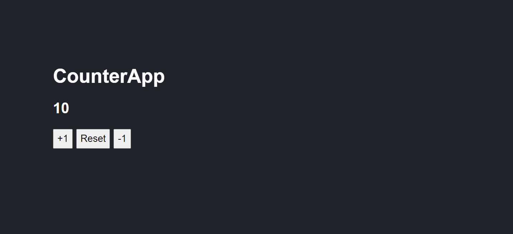

## Counter App

En este proyecto, se utiliza las siguientes características de React Js:

- Exposiciones sobre los componentes.

- Creación de componentes (Functional Components).

- Propiedades - Props.

- Impresiones en el HTML.

- PropTypes.

- DefaultProps.

- Introducción general a los Hooks.

- useState.

# Screenshot

